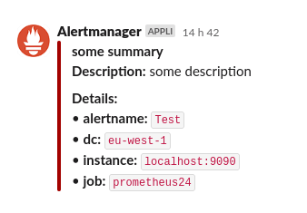

# slam
Send alertmanager alerts notifications to slack without creating webhook url for each slack channel.

It update the original slack channel message to avoid searching if an alert is resolved or not.



## usage

```
Usage of slam:
  -cache string
      Cache type (local or redis) (default "local")
  -cache.redis.db int
      Redis DB
  -cache.redis.host string
      Redis host (default "localhost:6379")
  -cache.redis.key-ttl int
      Redis key ttl in seconds (default 1296000)
  -debug
      Enable debug mode
  -server.grace-timeout int
       Grace timeout for shutdown HTTP server (default 5)
  -server.http-idle-timeout int
       Idle timeout for HTTP server (default 30)
  -server.http-listen-address string
       Listen address for HTTP server
  -server.http-listen-port int
       Listen address for HTTP server (default 8080)
  -server.http-read-timeout int
      Read timeout for HTTP server (default 30)
  -server.http-write-timeout int
      Write timeout for HTTP server (default 30)
  -server.tls-cert-path string
      TLS certificate path for HTTP server
  -server.tls-key-path string
      TLS key path for HTTP server
  -slack-msg-length-limit int
      Slack message length limit before truncate. (default 1000)
  -slack-token string
      Slack app token (could be set by SLACK_TOKEN env var)
  -template-files string
      Template files to load (files identified by the pattern, like *.tmpl)
  -template.annotation.title string
      Annotation key name to get for setting slack title message (default "summary")
  -template.annotation.title-link string
      Annotation key name to get for setting slack title link message (default "title_link")
  -version
      show version
```

## How it's works

slam use the webhook config from alertmanager: https://prometheus.io/docs/alerting/latest/configuration/#webhook_config

slam use the `groupKey` from webhook json payload, to identify if:
* the slack message has already been sent (for firing status)
* the original slack message should be updated (for resolved status)

This key is stored in local memory or redis.

If the key is not found, it send a new message in the slack channel.


## Template

As using webhook format, there is no templating from alertmanager. So we enable the template feature in slam to allow formating slack message. By default, we apply a simple slack message format (cf gif image)

It's possible to define different template and to choose it in the query url.

Run slam with template location:
```
slam -template-files examples/*.tmpl
```

Send an alert and use slack.tmpl file template:
```
curl "http://localhost:8080/webhook/mychann?template=slack.tmpl" -X POST -H "Content-type: application/json" -d @payload.json
```

## Setup alertmanager with slam (using webhook receiver)

```
global:
  resolve_timeout: 5m
route:
  receiver: webhook_receiver
receivers:
  - name: webhook_receiver
    webhook_configs:
      - url: http://localhost:8080/webhook/mychann
        send_resolved: true
```

## Prometheus metrics

slam expose standard prometheus metrics on `/metrics` endpoint.

```
# HELP promhttp_metric_handler_requests_in_flight Current number of scrapes being served.
# TYPE promhttp_metric_handler_requests_in_flight gauge
promhttp_metric_handler_requests_in_flight 1
# HELP promhttp_metric_handler_requests_total Total number of scrapes by HTTP status code.
# TYPE promhttp_metric_handler_requests_total counter
promhttp_metric_handler_requests_total{code="200"} 0
promhttp_metric_handler_requests_total{code="500"} 0
promhttp_metric_handler_requests_total{code="503"} 0
# HELP slam_message_sent_failed_total The total number of failed messages sent.
# TYPE slam_message_sent_failed_total counter
slam_message_sent_failed_total{channel="testfgx2"} 1
# HELP slam_message_sent_total The total number of successfully messages sent.
# TYPE slam_message_sent_total counter
slam_message_sent_total{channel="testfgx"} 1
```

## Endpoints

### Webhook API

Send slack message in a given channel
```
GET /webhook/<channel>
```
Status code: 200 if message sent.

Response: ok


### Ready / health API

Readiness check (check slack authentication)
```
GET /ready
```
Status code: 200 if ready.

Response: OK

Healthiness check
```
GET /health
```
Status code: 200 if healthy.

Response: OK

## Limitations

If the webhook payload contains several alerts, it will wait that all alerts be resolved before update the original message.
